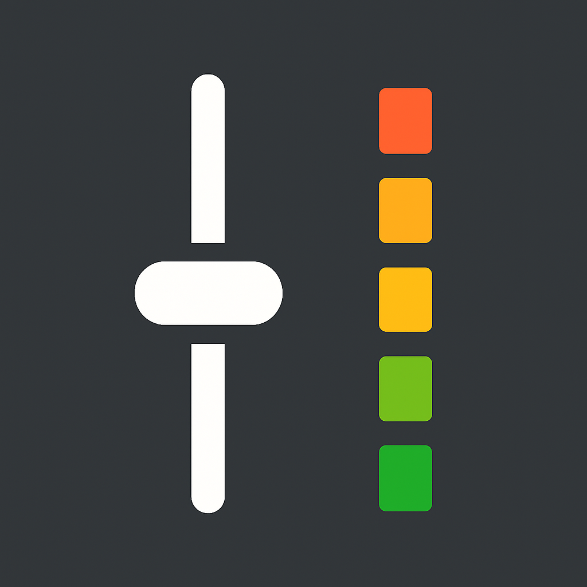

  

# DeejNG

DeejNG is a modern, extensible audio mixer and controller for Windows, built with WPF (.NET 9), NAudio, and SkiaSharp. It allows real-time control over system and app volumes using physical sliders (e.g. Arduino), complete with VU meters, mute toggles, and persistent target mappings.

This is meant as a companion app to the hardware. Serial/Arduino firmware can be found at https://github.com/omriharel/deej, and the button-capable fork at https://github.com/jimmyeao/ButtonDeej.

---

## 🚀 Features

- 🎛️ **Physical Slider Control** via serial (Arduino/COM port) or WebSocket (OledDeej)
- **Button Support** for toggle or momentary press buttons
- 🎚️ **Multiple Channels** with per-channel volume and mute
- 🎧 **Supports Applications, System Audio, Microphones, and Output Devices**
- 🔇 **Per-Channel Mute with Visual Feedback**
- 📈 **Smooth VU Meters** with SkiaSharp rendering
- 🔁 **Session Auto-Reconnect & Expiration Handling**
- 💾 **Persistent Settings** including targets, input mode, themes, and more
- 🌓 **Light/Dark Theme Toggle** with multiple theme options
- 🛠️ **Start at Boot** and **Start Minimized** options
- 🔊 **Control Unmapped Applications**
- 🎙️ **Input (Microphone) Device Volume Support**
- 🧠 **Smart Session Caching** and optimized session lookup
- 🧰 **Extensive Logging and Self-Healing Timers**
- 📋 **Multiple Profiles** for different scenarios (Gaming, Streaming, etc.)
- 🖥️ **OledDeej WebSocket Integration** with hardware-driven channel picker overlay

---

## 🧩 How It Works

- Channels (sliders) are represented by `ChannelControl` elements.
- Each slider is mapped to one or more **targets**:
  - System audio
  - Specific applications (by executable name)
  - Current application (by focused window)
  - Input devices (microphones)
  - Output devices (speakers/headphones)
  - Unmapped sessions (everything else)
- Volume data is received via **serial** (USB COM port) or **WebSocket** (OledDeej device).
- VU meters are driven by a 25ms dispatcher timer, showing real-time audio levels.
- Targets are assigned via a double-click on a channel, launching a session picker.

---

## 🖱️ Usage Instructions

### 🎚️ Setting Up Sliders (Serial Mode)

1. Connect your physical slider hardware (e.g. Arduino).
2. Launch DeejNG.
3. Select the correct COM port from the dropdown and click **Connect**.
4. Sliders will auto-generate based on incoming serial data (e.g. `0.5|0.3|...`).

### 🌐 Setting Up OledDeej (WebSocket Mode)

OledDeej is a Wi-Fi-enabled hardware device with an OLED display. DeejNG connects to it over WebSocket for two-way communication — volume changes on either end stay in sync.

1. In **Settings**, switch **Connection Mode** to **WebSocket**.
2. Enter the IP address and port of your OledDeej device.
3. Adjust the **encoder sensitivity** (coarse / medium / fine) and **screensaver timeout** as desired.
4. Click **Connect**. DeejNG will push channel config and current volume/mute state to the device on connect.

<!-- TODO: Add screenshot of WebSocket connection settings -->

### 🎯 Assigning Targets

- **Double-click a slider** to open the session picker.
- Select from running applications, "System", "Unmapped Applications", microphones, or output devices.
- You can select multiple targets per slider. One slider can control multiple apps or a mic.

### 🖥️ Hardware Channel Picker Overlay (OledDeej)

When using OledDeej in WebSocket mode, pressing the encoder button on a channel opens a floating **channel picker overlay** directly on your PC screen. This lets you reassign audio targets from the hardware device itself — no mouse needed.

- **Scroll the encoder** to browse Apps, Inputs, and Outputs.
- **Press the encoder** (or mute toggle) to confirm the selection.
- **Press BACK** to cycle through categories (Apps → Inputs → Outputs).
- The overlay closes automatically on confirm or cancel.

<!-- TODO: Add screenshot of channel picker overlay -->

### 🔇 Mute / Unmute

- Click the **Mute** button on each channel to toggle audio mute.
- The button will turn red when muted.
- In WebSocket mode, mute state is synced bidirectionally with the OledDeej device.

### 📊 Show/Hide Meters

- Use the "Show Sliders" checkbox to toggle VU meters.
- Meters update live with peak-hold animation.

### ⚙️ Settings

Settings are saved automatically and include:
- Assigned targets per slider
- Connection mode (Serial or WebSocket) and connection parameters
- Input mode per channel
- Theme preference
- Slider inversion
- Smoothing toggle
- Start on boot
- Start minimized
- Overlay timeout and opacity
- OledDeej encoder sensitivity and screensaver timeout

### ⚙️ Button Settings

Configure physical buttons for:
- **Media Control** — Play/Pause, Next, Previous, Stop
- **Mute Channel** — Toggle mute for a specific channel
- **Global Mute** — Toggle mute for all channels

### 📋 Profiles

Configure multiple profiles for different scenarios (Gaming, Streaming, Work, etc.). Each profile stores a complete snapshot of all channel assignments and settings.

<!-- TODO: Add screenshot of profiles UI -->

### 🔔 Floating Overlay

A configurable transparent overlay shows current volume levels when sliders are moved. Adjustable timeout, opacity, text colour, and screen position.

---

## 🔌 Connection Modes

| Mode | Hardware | Protocol | Notes |
|------|----------|----------|-------|
| Serial | Arduino / any COM device | USB serial, pipe-delimited values | Classic deej-style |
| WebSocket | OledDeej | TCP/WebSocket, JSON | Two-way sync, OLED display, encoder input |

---
